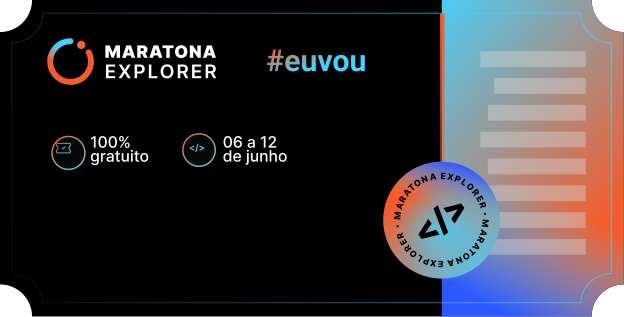

 "Logo Title Text 1")

# HTML
- HyperText Markup Language

- Hiper Texto?
- Marcação
  - tags
  - atributos
- Linguagem
  - maneira de escrever

# CSS

- Apresentação visual para o cliente
- Estilos para o HTML
- Cascading Style Sheets
  - Folha de Estilo em Cascata

# Declaração
- Seletor
- Propriedade e Valor

# Conceitos
- Cascata
- Especificidade
- Box Model
- Display block vs inline

### imagem bola de cristal
https://gist.githubusercontent.com/maykbrito/0acdf4ce919838ffed50915a31fc5b23/raw/6f4dd01ec3116428ec4c99255944cb9ac7927590/cristal-ball.svg
